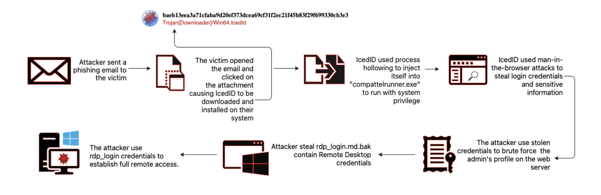

----------

  
The assessment was to create a report that will look over a malicious activity and outline a strategy to prevent similar events. I had to use various tools and techniques to review the logs, develop a comprehensive security policy, and make recommendations.

You will find all of the logs and help you might need 👉 [here](https://github.com/LGOG/Masterschool/tree/Final-Task)

There is also a TryHackMe room for this assessment 👉 [here](https://tryhackme.com/room/finalassessment)
  

-----------------------------------------
## Summery

Analysis of the sysmon.json file revealed a piece of malware, identified by its hash value of `baeb13eea3a71cfaba9d20ef373dcea69cf31f2ec21f45b83f29f699330cb3e3`, was detected on a Windows system. The malware, known as IcedID, was discovered when it created a new process, "calculator.exe," on the system. The process was launched from the command line and ran with system level privileges. 

This behavior typically related to process hollowing, which is a technique used by malware to hide within legitimate processes on a victim's system in order to evade detection. The malware replaces the legitimate process with its own code while keeping the original process's name and appearance. This allows it to perform malicious actions while remaining hidden.

the malicious actor used this foothold to perform other malicious activities, such as attempting to brute force the web server and steal more credentials as revealed in the access.log file. The stolen credentials, rdp_login.md.bak, may have been used to further compromise the system or other systems on the network.

<h4>IcedID</h4> is a banking trojan that targets user financial information and can also act as a dropper for other types of malware. It uses man-in-the-browser attacks to steal login credentials and other sensitive information, which it then uses to take over financial accounts and conduct money transactions. IcedID is often spread through spam emails and phishing, and can inject itself into the memory of an operating system or regular processes in order to evade detection. The creators of IcedID frequently update the malware to increase its persistence and avoid detection by security software. capable of disguising itself as legitimate software, displaying fake update prompts, and bypassing two-factor authentication.
  
IcedID establishes persistence on an infected system through process-hollowing. After infection, it hooks certain Application Programming Interface (API) functions, and creates a service host process called “svchost.exe” for example. 
The sysmon.log seems to reveal a pretty long list of legitimate processes and built-in windows programs that has been replaced and modified by the malware, few of them:
VSSVC.exe ,compattelrunner.exe ,calculator.exe ,net.exe ,lsass.exe ,msiexec.exe, cmd.exe ,reg.exe.
  
IcedID then writes itself into two Dynamic Link Libraries, and writes its payload into the `"%ProgramData%"` or `"%AppData%"` folder. It also creates a scheduled task that allows it to execute every time the system reboots. It establishes a proxy server to monitor and redirect victim traffic, and uses fake websites to socially engineer victims into providing login credentials. It communicates with its C2 server via HTTPS and uses unique client IDs to identify individual infections. 
 
 

more details -> [VirusTotal](https://www.virustotal.com/gui/file/baeb13eea3a71cfaba9d20ef373dcea69cf31f2ec21f45b83f29f699330cb3e3/behavior)

 
 

~ Created with <a href="https://www.diagrams.net/" target="_blank">Diagrams</a>.

--------------------------------------------------------------------------------

## Recommendations
•	Regularly scan systems for malware and keep antivirus software up-to-date.

•	Deploy and centrally monitor antivirus software on all endpoints.

•	Apply patches and updates promptly after testing.

•	Use strong passwords and implement multi-factor authentication where possible.

•	Use application whitelisting to prevent unknown programs from executing on servers and restrict web 
browsing with unapproved browsers.

•	Allow only authorized, digitally signed scripts to run on systems.

•	Disable macros or create an Active Directory Organizational Unit for users who need them enabled.

•	Use email gateway filters to block known malspam indicators and suspicious IP addresses at the 
firewall.

•	Mark external emails with a banner and implement Domain-based Message Authentication, Reporting and 
Conformance (DMARC) policy and verification.

•	Provide social engineering and phishing training to employees and create a policy for reporting 
suspicious emails.

•	Regularly create backups of systems and store them separately.

•	Use Group Policy to restrict inbound SMB communication between client systems and implement 
host-based intrusion prevention measures.

•	Follow the principle of least privilege and limit administrative credentials to designated 
administrators.

•	Follow best practices such as the CIS Controls.

•	If a malicious email is opened or an infection is suspected, run an antivirus scan and isolate the 
infected computer.

•	Isolate infected machines and take them off the network.

•	Implement host-based isolation measures to mitigate propagation.

•	Remediate multi-homed systems first as they may be able to spread malware across VLANs.

•	Create clean VLANs for re-imaged or restored systems and do not login to infected systems with 
administrative credentials.

•	Disconnect network cables and power down infected systems before re-imaging or restoring them.

•	Ensure that all systems are patched and up-to-date before reconnecting them to the network.

•	Monitor systems for any unusual activity after the incident.

