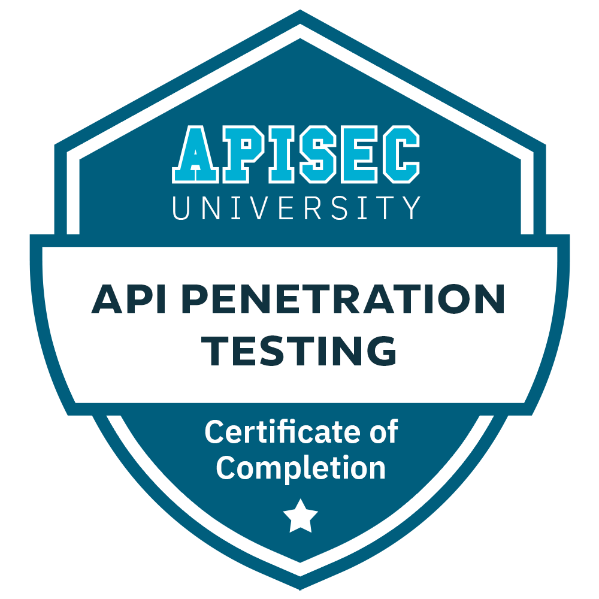

# Useful Resources

---

## Recon Like A Boss

**[Author: Dirty Coder(@dirtycoder0124)](https://twitter.com/dirtycoder0124)**

**Objectives:**
- Increase Your Attack Area
- Determine Technologies used by Website.
- Amazon Web Service (AWS) Recon & Hacking • GithubRecon
- ContentDiscover

####  Link: [Recon Like A Boss](https://bugbountytuts.files.wordpress.com/2019/01/dirty-recon-1.pdf)

---

## CEH-Exam-Questions

**Author: yeahhub.com 
Github repository By ryh04x**

**Objectives:**

 - Assessment Test (35)
 - Introduction (20)
 - System Fundamentals (20)
 - Cryptography (20)
 - Footprinting (20)
 - Scanning (20)
 - Enumeration (20)
 - System Hacking (20)
 - Malware (20)
 - Sniffers (20)
 - Social Engineering (20)
 - Denial of Service (20)
 - Session Hijacking (20)
 - Web Servers & Applications (20)
 - SQL Injection (20)
 - Hacking Wi-Fi & Bluetooth (20)
 - Mobile Device Security (20)
 - Evasion (20)
 - Cloud Technologies & Security (20)
 - Physical Security (20)

#### Link: [CEH Exam Questions](https://github.com/ryh04x/CEH-Exam-Questions)

---

## Offensive Security Notes and Exam
By [Joas Antonio Dos Santos](https://www.linkedin.com/in/joas-antonio-dos-santos)

[OSCP AD (Offensive Security Professional)](https://drive.google.com/file/d/14jirVKvHwaFT9789nbQoLHNsmHRGysmH/view)

[OSWE Notes (Offensive Security Web Expert)](https://drive.google.com/file/d/1KIc_qsRvlWbaUY04ug9_4zEXySx53yGv/view)

[OSWA Notes (Offensive Security Web Assessor)](https://drive.google.com/file/d/1EEA-y38qH7DOLK2N3XgIid_pNnTiGxtN/view)

[OSEP Notes (Offensive Security Experienced PenTester)](https://drive.google.com/file/d/1L9mfwfzu95B6ukmw425Etbf5hl76u6OC/view)

[OSED Notes (Offensive Security Exploit Development)](https://drive.google.com/file/d/1_mPHr3b3oUhzdwcsC62J4vlX72QZYzzh/view)

[OSDA Notes (Offensive Security Defense Analyst)](https://drive.google.com/file/d/18cAE7QX-kh6zN95pn7-H-VMbjtQoUfHN/view)

[OSMR Notes (Offensive Security MAC Research)](https://drive.google.com/file/d/1qMOKmeFY9dOlpqQ6YCy-4xB_Uqc1AEWf/view)

---

##  APISEC University  - API Penetration Testing Course

**Instructor: Corey Ball**

**Objectives:**

- Lab Setup
- API Reconnaissance
- Endpoint Analysis
- Scanning APIs
- API Authentication Attacks
- Exploiting API Authorization
- Testing for Improper Assets Management
- Mass Assignment
- Injection Attacks
- Rate Limit Testing
- Combining Tools and Techniques
  
#### Link: [API-SEC](https://www.apisecuniversity.com/courses/api-penetration-testing)
