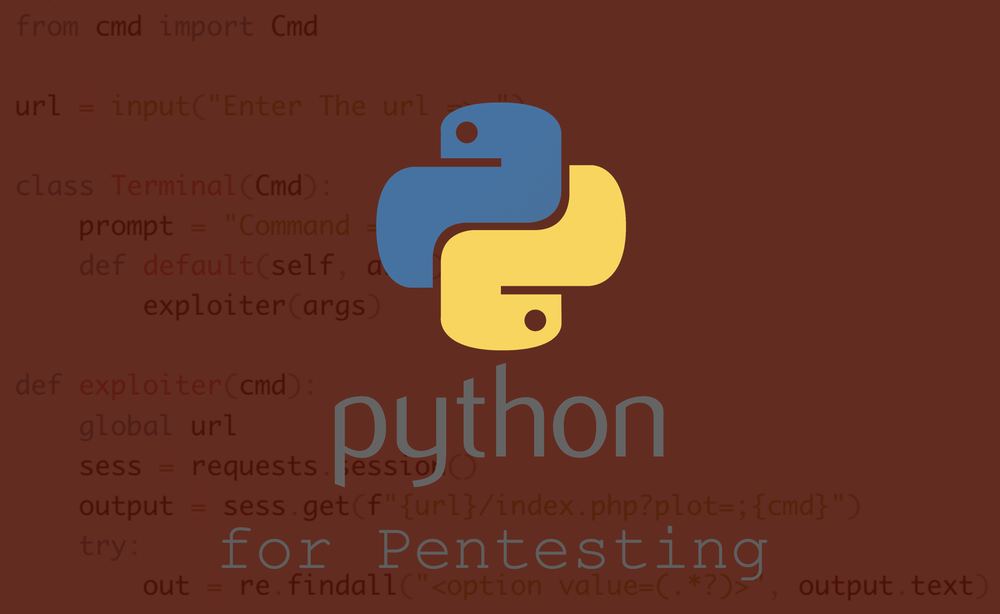

 

  

  

---

 
This Tutorial is designed to provide a basic introduction to Python for use in the area of Pentesting. we will learn various Python scripting techniques and the essential fundamentals needed to create and run automated tasks. 
  
It is recommended to have some prior experience with Python, including basic knowledge of variables, lists, and classes. Additionally, a fundamental understanding of security principles and potential cyber-attacks would prove useful.
  

 ## Resources

&rarr; <a href="https://www.linkedin.com/learning/python-for-security/python-for-security?autoplay=true&u=102947196" target="_blank">Linkedin Courses - Python for Security</a>

&rarr; <a href="https://bit.ly/EthicalHackingPython" target="_blank">Udemy - Learn Python and Ethical Hacking from scratch</a>

&rarr; <a href="https://tryhackme.com/room/pythonforcybersecurity" target="_blank">TryHackMe - Python for Pentesters</a>

&rarr; <a href="https://www.thepythoncode.com" target="_blank">ThePythonCode</a>

---

 
 <a href="/docs/tutorials/pythonpentesting/portscanner/">Port Scanner and Grabber &rarr;</a>
  

