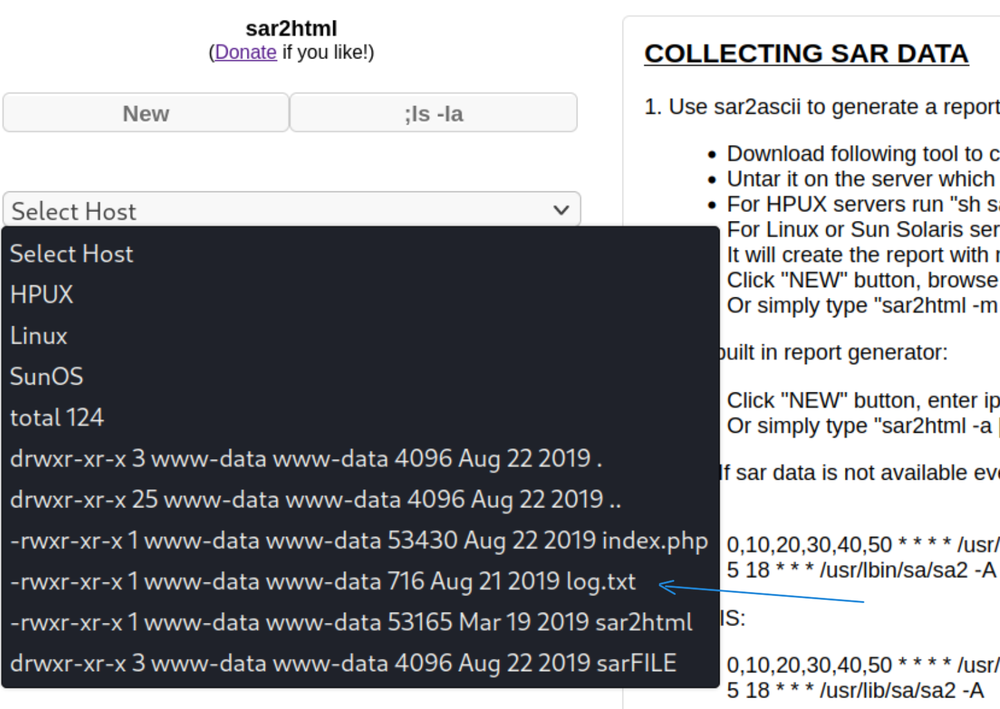

 

~ ***by Tom Rosenzweig***

---

# Questions #1

---

## File extension after anon login

**Method**

First of all, let's starts with an nmap scan. 

    nmap -sC -sV -p- 10.10.190.117

-sC : Run the default set of scripts that are associated with the most commonly used ports.

-sV : Perform version detection on open ports.

-p- : All ports

  

  

As the scan results show, port 21 is open and running an FTP service that allows anonymous login. Three other ports are also open:

80: Apache httpd

10000: Miniserv (Webmin httpd)

55007: SSH (Usually runnnig on port 22)

  

To answer the first question we need to log in to the FTP server, via anonymous user (no password) 

    ftp 10.10.190.117

  

    

  

We can see the file extantion for the first question. 
and this text: "Whfg jnagrq gb frr vs lbh svaq vg. Yby. Erzrzore: Rahzrengvba vf gur xrl!"   it's meant to throw you off. you can decrypt it with ROT 13:  
  

 --> [CyberChef](https://gchq.github.io/CyberChef/)

 

  **Answer** : txt

 

## What is on the highest port?

 **Answer** : ssh

 

## What's running on port 10000?

 **Answer**: webmin

 

## Can you exploit the service running on that port? (yay/nay answer)
 

**Method**

I went to 10.10.190.117:10000 
Nothing interesting there and it seems to be secured. 

**Answer**: nay

 

## What's CMS can you access?

**Method**

To answer this question, we can start by conducting a simple directory scan with **gobuster**. It is recommended to perform this scan at the start of an enumeration process, along with an nmap scan, to save time. Other tools such as feroxbuster, dirb, etc, can also be used for this purpose.

    gobuster dir -u  http://10.10.190.117/ -w /usr/share/wordlists/dirb/common.txt

    

The output of the enumeration includes the directories/files that were discovered, their status codes, and sizes. Here is a brief explanation of the results:

**/.hta** is commonly used to store configuration settings for web servers. It is often used to restrict access to sensitive files and directories, so it is not surprising that it returns a 403 (Forbidden) status code, indicating that access to the file is not allowed.

**/.htpasswd** is a file that is used to store usernames and passwords for HTTP Basic authentication. Like the .hta file, it is often used to restrict access to sensitive resources, so it also returns a 403 status code in this case.

**/.htaccess** is a file that is used to configure various aspects of the web server, such as URL rewriting and access control. It is often used to restrict access to directories and files, so it also returns a 403 status code in this case.

**index.html** is the default file that is served when a user visits the root directory of a website. In this case, it returns a 200 (OK) status code, indicating that the file exists and can be accessed.

**joomla** is a directory that was discovered. It returns a 301 (Moved Permanently) status code, indicating that the directory has been moved to a new URL (http://10.10.178.88/joomla/).

**manual** is another directory that was discovered. It also returns a 301 status code, indicating that it has been moved to a new URL (http://10.10.178.88/manual/).

**robots.txt** is a file that is used to provide instructions to web robots and crawlers. It returns a 200 status code in this case, indicating that the file exists and can be accessed.

**server-status** is a URL that is often used to obtain information about the status of the web server. In this case, it returns a 403 status code, indicating that access to this resource is not allowed.

 

Of these, joomla, manual, and robots.txt can be accessed. The manual page is just documentation of the Apache server and does not seem to be useful. robots.txt can sometimes be useful during enumeration as it can indicate the presence of sensitive or important files, but this time it's meant to throw you off.

  
You can waste your time by trying to decrypt that decimal line. the result of that:
  
CyberChef
  
Crackstation

  

Let's move on to joomla. by quick look we can assume that this is the accessible CMS (Content Management System) 

 **Answer**: joomla

 

## The interesting file name in the folder?

At this stage, we need to go deeper and search for other places that might be vulnerable and can lead to our file. Let's run gobuster again but this time we'll include the joomla directory:

    gobuster dir -u  http://10.10.190.117/joomla -w /usr/share/wordlists/dirb/common.txt

  

After exploring all these directories, a major vulnerability has been found on http://10.10.190.117/joomla/_test 

sar2html is a tool that converts the system activity data collected by the SAR (System Activity Reporter) tool into an HTML format, making it easier to read and analyze.  that seems to be suspicious. By conducting some simple tests on it, an XSS vulnerability has been discoverd:

 
   
Further research led to a command injection and remote code execution, which was found on the Exploit-DB website. --> [exploit-db](https://www.exploit-db.com/exploits/47204):

Try this:

 **Answer**: log.txt

# Questions #2

---

## Where was the other users pass stored(no extension, just the name)?

**Method**

Let's move on:

    index.php?plot=;cat+log.txt

Credentials has been found! 

- username: basterd 
- password: superduperp@$$

So we already know that ssh is open on port 55007, let's try to connect.

    ssh basterd@<target-ip> -p 55007

    ls -la
    cat backup.sh
    

Credentials: 
- stoner
- superduperp@$$no1knows
  
 **Answer**: backup

## user.txt

**Method**

Connect to stoner

    cat user.txt
    
 **Answer**: You made it till here, well done.

## What did you exploit to get the privileged user?

**Method**

By viewing the questions we know that we need to find the root.txt.
Let's use the `find` command to see the path of the file.

    find / -name root.txt
    cat /root/root.txt

Permission is denied.   One way to bypass it is to use a common misconfiguration in the **find** command by leveraging its ability to execute arbitrary commands with root privileges, using the **-exec** option. 

Let's start by creating an empty file named "pwnd" (you can name it what ever you want).
we can use vi editor for that

Insert a single period ``.`` into the file then save and quit: ``ESC``, ``:wq!``.

Run this command:

     find pwnd -exec cat /root/root.txt \;

Since the find command is running with root privileges, the cat command is also executed with root privileges, which allows us to read the contents of the root.txt file.

 **Answer**: find

## root.txt

 **Answer**: It wasn't that hard, was it?

  

---

